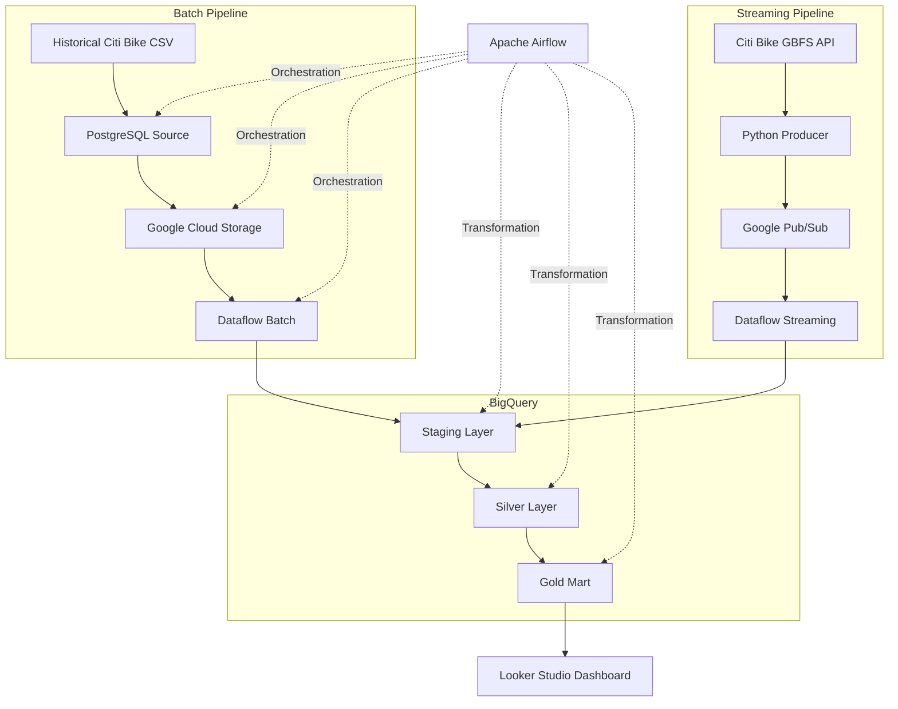

# Final Project — Citi Bike Batch & Streaming Data Pipeline

## 1. Project Overview

Project ini merupakan Final Project dari Bootcamp Data Engineer Purwadikha yang membangun pipeline **batch dan streaming** menggunakan data Citi Bike.

Tujuan utama project adalah:

- memproses data historical trip Citi Bike menggunakan batch pipeline,
- memproses status station secara real-time menggunakan streaming pipeline,
- menyimpan data ke BigQuery dengan layer **Staging → Silver → Gold**,
- melakukan orchestration menggunakan Apache Airflow,
- melakukan data quality check,
- melakukan monitoring anomaly pada station,
- menampilkan hasil analisis melalui Looker Studio dashboard.

---

## 2. Cara Menjalankan Project

### Step 1 — Clone Repository

```powershell
git clone https://github.com/jonathansionk/final_project_citi_bike_batch_streaming_pipeline.git
cd final-project
```

### Step 2 — Create Virtual Environment

```powershell
python -m venv .venv
.venv\Scripts\activate
```

### Step 3 — Install Dependencies

```powershell
pip install -r requirements.txt
```

### Step 4 — Create `.env`

Buat file `.env` lalu isi seluruh environment variable yang dibutuhkan seperti di File .env.example.

### Step 5 — Authenticate Google Cloud

```powershell
gcloud auth application-default login
```

### Step 6 — Start Docker / Airflow

```powershell
docker compose up -d
```

Buka Airflow:

```text
http://localhost:8086
```

### Step 7 — Load Historical Raw Trips Data to PostgreSQL

```powershell
python scripts/postgres/load_raw_to_postgres.py
```

### Step 8 — Run Batch Pipeline

Trigger DAG:

```text
citibike_batch_ingestion
```

Flow:

```text
PostgreSQL
→ GCS
→ trigger citibike_batch_transform
→ Dataflow
→ BigQuery Staging
→ Silver
→ Gold
```

### Step 9 — Run Streaming Pipeline

Jalankan streaming Dataflow:

```powershell
python scripts/streaming/load_streaming_bq.py
```

Kemudian jalankan producer:

```powershell
python scripts/streaming/producer.py
```

Untuk test invalid event:

```powershell
python scripts/streaming/producer.py --invalid-every 20
```

Untuk test anomaly:

```powershell
python scripts/streaming/producer.py --anomaly-every 15
```

Untuk keduanya:

```powershell
python scripts/streaming/producer.py --invalid-every 20 --anomaly-every 15
```

---


## 3. Business Questions

1. Bagaimana tren jumlah trips/perjalanan Citi Bike setiap bulannya ?
2. Station mana yang memiliki aktivitas paling tinggi ?
3. Bagaimana perbandingan penggunaan antara member dan casual user ?
4. Berapa jumlah bike yang tersedia berdasarkan status station terbaru ?
5. Berapa jumlah station yang masih aktif / operational ?
6. Apakah terjadi penurunan jumlah bike yang tidak normal pada suatu station ?

---

## 4. Business Solution

Pipeline ini menghasilkan beberapa insight dan monitoring:

- **Trip Trend** untuk melihat perkembangan jumlah trip.
- **Top Station Activity** untuk mengetahui station dengan aktivitas tertinggi.
- **Member vs Casual** untuk melihat proporsi tipe pengguna.
- **Latest Station Status** untuk melihat jumlah bike terbaru pada setiap station.
- **Active Station Monitoring** untuk melihat station yang masih operational.
- **Anomaly Monitoring** untuk mendeteksi penurunan bike yang tidak normal.

---

## 5. Data Sources

### Batch Data

Historical Citi Bike trip data bulan Januari - Agustus 2026 dalam format CSV.

Batch data dimuat ke PostgreSQL terlebih dahulu sebelum diekstrak ke Google Cloud Storage.

### Streaming Data

Streaming menggunakan GBFS Citi Bike API:

`station_information` digunakan untuk metadata station, sedangkan `station_status` digunakan untuk status operational terbaru seperti jumlah bike, dock, dan status renting/returning.

---

## 6. Technology Stack

- Python
- SQL & PostgreSQL
- Apache Airflow
- Google Cloud Storage
- Google Pub/Sub
- Google Dataflow / Apache Beam
- Google BigQuery
- Looker Studio
- Docker Compose
---

## 7. Pipeline Architecture



---

## 8. Airflow Orchestration

### A. Batch Ingestion DAG

DAG:

```text
citibike_batch_ingestion
```

Flow:

```text
check_postgres_source
        ↓
extract_postgres_to_gcs
        ↓
trigger_batch_transform
```

Untuk schedule:

```python
schedule="0 0 * * *"
```

Setelah ingestion berhasil, DAG ini memicu DAG transform menggunakan `TriggerDagRunOperator`.

### B. Batch Transform DAG

DAG:

```text
citibike_batch_transform
```

DAG ini menggunakan:

```python
schedule=None
```

karena dijalankan setelah batch ingestion berhasil.

Flow utama:

```text
Create Staging Dataset
        ↓
GCS → Dataflow → BigQuery Staging
        ↓
Create Staging Dimensions
        ↓
Staging Quality Check
        ↓
Create Silver Dataset
        ↓
Silver Transform
        ↓
Silver Quality Check
        ↓
Create Gold Dataset
        ↓
Create Gold Marts
        ↓
Gold Quality Check
```

Airflow juga mengirim failure alert melalui email jika task gagal setelah retry.

### C. Streaming DAG

File DAG:

```text
airflow/dags/streaming_ingestion.py
```

Streaming pipeline digunakan untuk mengalirkan Citi Bike station status melalui Pub/Sub dan Dataflow ke BigQuery.

---

## 9. Data Model

### Staging Layer

Dataset:

```text
final_project_jonathan_staging
```

Main objects:

```text
fact_citibike_trips_stg
fact_valid_stream_station_event
fact_invalid_stream_station_event
dim_batch_station_reference
dim_stream_station_reference
```

### Silver Layer

Dataset:

```text
final_project_jonathan_silver_transform
```

Main objects:

```text
fact_citibike_trips_cleaned
fact_valid_stream_cleaned
dim_station_mapping
```

### Gold Layer

Dataset:

```text
final_project_jonathan_gold_mart
```

Gold marts:

```text
mart_daily_trip_summary
mart_latest_station_status
mart_station_anomaly_monitoring
mart_station_summary
mart_station_user_summary
mart_user_type_summary
```


## 10. Project Structure

```text
final-project/
│
├── airflow/
│   └── dags/
│       ├── citibike_batch_ingestion.py      --> DAG untuk mengecek source PostgreSQL, extract data batch dari PostgreSQL ke GCS, lalu trigger DAG transform
│       ├── citibike_batch_transform.py      --> DAG untuk load data batch dari GCS ke BigQuery melalui Dataflow, lalu transform Staging → Silver → Gold
│       └── streaming_ingestion.py           --> DAG untuk menjalankan pipeline streaming dan memastikan data streaming masuk ke BigQuery staging
│
├── scripts/
│   ├── batch/
│   │   ├── extract_postgres_to_gcs.py       --> Mengambil data trip dari PostgreSQL, membagi data per tanggal, lalu upload ke GCS
│   │   └── load_batch_bq.py                 --> Menjalankan Apache Beam/Dataflow untuk membaca data batch dari GCS dan load ke BigQuery staging
│   │
│   ├── postgres/
│   │   └── load_raw_to_postgres.py          --> Membaca raw CSV Citi Bike dari local lalu memasukkannya ke tabel raw PostgreSQL
│   │
│   └── streaming/
│       ├── producer.py                      --> Mengambil data Citi Bike API, membuat event Avro, lalu publish ke Pub/Sub; juga digunakan untuk inject invalid dan anomaly data
│       ├── load_streaming_bq.py             --> Menjalankan Dataflow streaming dari Pub/Sub, melakukan validasi, lalu memisahkan data valid dan invalid ke BigQuery
│       └── schemas/
│           ├── station_status_event.avsc    --> Avro schema untuk struktur event station sebelum dikirim ke Pub/Sub
│           ├── valid_data_events_stream.json
│           │                                --> Schema untuk data streaming valid yang disimpan ke BigQuery
│           └── invalid_data_events_stream.json
│                                            --> Schema untuk data streaming invalid/rejected yang disimpan ke BigQuery
│
├── sql/
│   ├── postgres/
│   │   ├── ddl/
│   │   │   ├── create_raw_citibike_trips.sql
│   │   │   │                                --> Membuat tabel raw_citibike_trips di PostgreSQL
│   │   │   └── create_index_raw_citibike.sql
│   │   │                                    --> Membuat index pada raw table untuk mempercepat filter/query berdasarkan started_at
│   │   │
│   │   ├── extract-gcs/
│   │   │   ├── extract_raw_citibike.sql     --> Query untuk mengambil data trip dari PostgreSQL berdasarkan range tanggal
│   │   │   └── extract_trip_dates.sql       --> Query untuk mengambil daftar tanggal trip unik sebagai dasar proses extract harian
│   │   │
│   │   └── quality/
│   │       └── cek_raw_citibike.sql         --> Quality check untuk memastikan raw source PostgreSQL memiliki data
│   │
│   ├── staging/
│   │   ├── ddl/
│   │   │   └── create_staging_dataset.sql   --> Membuat dataset BigQuery untuk Staging Layer
│   │   │
│   │   ├── dim/
│   │   │   ├── batch_station_reference.sql  --> Membuat reference/dimension station dari historical batch trip
│   │   │   └── stream_station_reference.sql --> Membuat reference/dimension station dari streaming station metadata
│   │   │
│   │   └── quality/
│   │       └── cek_staging.sql              --> Quality check untuk memastikan data batch dan streaming tersedia di Staging Layer
│   │
│   ├── silver/
│   │   ├── ddl/
│   │   │   └── create_silver_dataset.sql    --> Membuat dataset BigQuery untuk Silver / Transformation Layer
│   │   │
│   │   ├── dim/
│   │   │   └── station_mapping.sql          --> Membuat mapping station antara data batch dan data streaming
│   │   │
│   │   ├── fact/
│   │   │   ├── transform_trip_silver.sql    --> Membersihkan dan mentransformasi batch trip menjadi fact_citibike_trips_cleaned
│   │   │   └── transform_stream_silver.sql  --> Membersihkan dan mentransformasi valid streaming event menjadi fact_valid_stream_cleaned
│   │   │
│   │   └── quality/
│   │       └── cek_silver.sql               --> Quality check untuk hasil transformasi pada Silver Layer
│   │
│   └── gold/
│       ├── ddl/
│       │   └── create_gold_dataset.sql       --> Membuat dataset BigQuery untuk Gold Mart
│       │
│       ├── mart/
│       │   ├── daily_trip_summary.sql        --> Membuat ringkasan trip harian untuk total trips dan monthly trip trend
│       │   ├── latest_station_status.sql     --> Mengambil status terbaru per station untuk Bikes Available dan Active Stations
│       │   ├── station_monitoring.sql        --> Mendeteksi anomaly penurunan jumlah bike berdasarkan event sekarang dan event sebelumnya
│       │   ├── station_summary.sql           --> Membuat ringkasan aktivitas station untuk Top Stations by Activity
│       │   ├── station_user_summary.sql      --> Membuat ringkasan penggunaan station berdasarkan member dan casual user
│       │   └── user_type_summary.sql         --> Membuat ringkasan keseluruhan member vs casual user
│       │
│       └── quality/
│           └── cek_gold.sql                  --> Quality check untuk memastikan seluruh Gold Mart berhasil dibuat
│
├── .gitignore                               --> Menentukan file/folder yang tidak boleh di-upload ke GitHub seperti .env, .venv, logs, raw data, dan credential
├── docker-compose.yml                       --> Konfigurasi Docker untuk PostgreSQL source, PostgreSQL Airflow metadata, dan service Airflow
├── dockerfile.airflow                       --> Custom Airflow image dan instalasi dependency dari requirements.txt
├── requirements.txt                         --> Daftar Python package/dependency yang dibutuhkan project
└── README.md                                --> Dokumentasi project, arsitektur, cara menjalankan pipeline, dan struktur repository
```

---

## 11. Environment Configuration

File `.env` **tidak disimpan di GitHub** karena berisi konfigurasi dan credential.

Setelah clone repository, buat file:

```text
.env
```

di root project, file .env berisi konfigurasi yang di perlukan seperti konfigurasi di GCP, Airflow, Postgre, dan lainnya.


## 12. Dashboard

Dashboard dibuat menggunakan Looker Studio.

Main visual:

- Total Trips
- Bikes Available
- Active Stations
- Anomaly Alerts
- Monthly Trip Trend
- Member vs Casual
- Top Stations by Activity
- Latest / Anomaly Station Monitoring

Contoh kolom pada tabel anomaly:

```text
Station Name
Anomaly Status
Previous Bikes
Current Bikes
Bike Drop
Detected At
```

---

## 13. Conclusion

Project ini berhasil membangun pipeline data  **batch processing dan streaming processing** untuk Citi Bike.

Batch pipeline:

```text
PostgreSQL → GCS → Dataflow → BigQuery
```

Streaming pipeline:

```text
GBFS API → Pub/Sub → Dataflow → BigQuery
```

Data kemudian ditransformasikan melalui:

```text
Staging → Silver → Gold
```

dan digunakan oleh Looker Studio untuk analytical reporting dan station monitoring.

Apache Airflow digunakan untuk orchestration, scheduling, dependency management, data quality check, dan failure alert.
